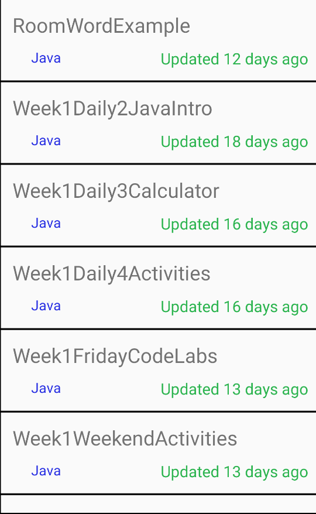
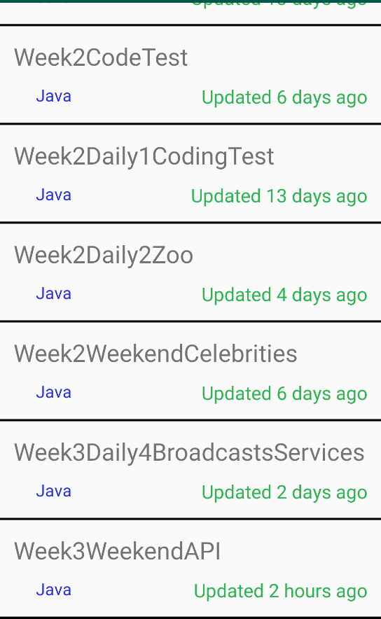

# Week5Daily2JavaToKotlinRefactor

This is the same application as the Week3WeekendAPI refactored into Kotlin. The original application in Java used the HttpUrlConnection class to make REST calls and AsyncTasks for the threading scheme. This application uses Retrofit for the REST calls and RxJava for the threading scheme.

  
